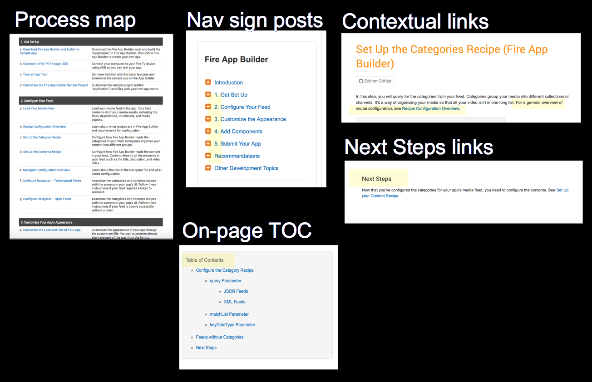

## Where the problem first surfaced

If you've ever had the opportunity to watch someone use your documentation in a lab, but it can be pretty eye-opening. A few years ago I worked at a company that had a usability lab. It was actually left over from the previous company that inhabited the building. At some point our company formed a usability team and started to do some testing in the room.

Usability labs are set up similar to interrogation rooms, with one-way mirrored glass separating two rooms. On one side, the participant uses a computer, often following prompts from a usability tester. In the other room, behind the mirrored glass, the designers, engineers, program managers, and other stakeholders eagerly watch the participants fumble and act like "idiots."

When I heard about these tests, I persuaded our usability tester to push users into my documentation so we could evaluate their effectiveness. The tester would ask users to do a difficult task, a task they wouldn't be able to figure out from the interface on their own. Eventually the user either clicked the help or, more commonly, the usability tester suggested they look in the help for the answer.

(Actually, the user would often draw a blank with the task. The usability tester would ask, Where can you find help that would give you more information about this? Users would continue with the blank stare. The usability tester would then ask, Could the documentation be helpful in finding this information? A light would then go on in the user's head. Watching this scenario unfold was truly mind-boggling.)

After the users forayed into the help, they began a meandering path of poking around, skimming, scanning, browsing, reading here and there, and generally not finding their answers. I wrote about these [general observations here](https://idratherbewriting.com/2011/07/22/a-few-notes-from-usability-testing-video-tutorials-get-watched-text-gets-skipped/). Different users prefer different types of content, and they have different ways of consuming the information (new users watch videos, advanced users skim and scan text). But they all have one thing in common: both spend most of their time looking for the right answer only to not find it, and eventually they give up.

Granted, we didn't have more than half a dozen participants, but it seemed rare that a user would actually found the answer in the help. They click links, scroll, hunt around in studious ways, and regularly fails to see the answer when they were staring right at it on the page.

This experience helped me realize one of the biggest challenges in documentation: helping users find the right answer amid a sea of documentation topics. We spend a lot of time developing clear, accurate information, but if users can't find it, that information does them no good.

We don't sink nearly enough time into solving issues of findability in documentation. Perhaps we're too busy writing the information or reviewing it with engineers to consider that users may never actually find what we're so diligently creating.

## New company ... same problem

The idea that users can't find info in docs (assuming that the info exists) isn't an isolated or unique problem. The findability problem addresses the core of what it means to create documentation. A few years later I started working at another company only to run into the same findability issues. (I'm sure the problem continued regularly at every company I've worked at, but I didn't always have access to observe or gather info from users, so I generally didn't know. Tech writers usually operate in the dark about how their information product (the documentation) is used &mdash; this mindset allows tech writers to continue believing in higher purpose of their undervalued work.)

In this new go-around, the company had hired a third party to evaluate the product and its documentation. And this time the audience consisted of developers creating apps, not end users interacting with a user interface. Unsurprisingly, the users reported difficulty in finding the information.

Granted, there were a lot of issues with the product, and the studies weren't targeted at just evaluating the docs. Users complained about information being circular and redundant in places, being poorly organized. Not being able to locate the right information again surfaced in their myriad complaints. It seems the findability problem just wouldn't go away.

How can we help users find what they're looking for in our documentation? How can we eradicate this problem once and for all so that users can locate the right information quickly and efficiently, without so much hunting, scrolling, and fruitless searching?

## Starting points with design

When thinking about strategies for navigation within your documentation, it's helpful to start with some design principles that have already been developed and studied, even if the design principles weren't necessarily formulated in documentation or information scenarios. This is especially necessary because there isn't ample tech comm research about navigation patterns within documentation.

In the book [Universal Principles of Design](https://www.amazon.com/Universal-Principles-Design-Revised-Updated/dp/1592535879/ref=pd_lpo_sbs_14_img_0?_encoding=UTF8&psc=1&refRID=Z3N8PRGT94SFH1Z5765N), the authors explore design principles that they feel are universal and which apply across a wide variety of industries, products, and scenarios. The book provides concise summaries about a range of design topics.

From 125 separate design principles, there are a handful of design principles that I think have particular relevance to document navigation. The core principles include the following:

* Hierarchy
* Progressive disclosure
* Immersion
* Desire line
* Modularity
* Wayfinding

Applying these principles in the way we design our docs can create a better experience for users, both in their ability to find and navigate information.

Rather than just discussing these principles abstractly, I'll explain how I tried to improve my docs be applying these design principles to the content.

## Action 1: Group topics in product sidebars

When I started at my current company, the content was organized in a flat way on a web CMS. By flat, I mean each page existed as an independently floating page, without any structure in a sidebar navigation (apart from a general category) that would show various groupings of content in parent-child trees. It was kind of like a knowledge base, only the content consisted of documentation, not standalone support articles.

The lack of this sidebar was mainly due to the platform &mdash; as a general web CMS, the platform didn't support granular navigation of tech docs in a sidebar.

I found the lack of a sidebar challenging as I tried to use the content. How big was the documentation for each product? 5 pages? 500 pages? What pages and topics were included or relevant in the documentation? In other words, what was there to know about the topic?

I decided that each product needed a sidebar that would show the general pages in that collection of documentation. It wasn't too much trouble to hack a sidebar in there to serve this purpose.

There wasn't room on the left, since the general category sidebar occupied that space. So I added it on the right.

### Design principle: Hierarchy

One of principles of design in <a href='https://www.amazon.com/Universal-Principles-Design-William-Lidwell/dp/1592530079'>Universal Principles of Design</a> is hierarchy.

<b>Hierarchy:</b> "Hierarchical organization is the simplest structure for visualizing and understanding complexity." &mdash; <a href='https://www.amazon.com/Universal-Principles-Design-William-Lidwell/dp/1592530079'>Universal Principles of Design</a>

When we organize our documentation, we usually create a hierarchical outline of the content to help users both understand and visualize the body of information. We usually have a sidebar navigation feature that lists the topics in the documentation (within a particular product scope). The documents are often grouped in parent-child trees.

A good example of hierarchy in a sidebar is with Google.

Here you can see that the various topics appear in the left, divided into different groups.

Creating a hierarchical sidebar is nothing new in documentation, for sure. It's odd *not* to have one, and only when your content is more like a knowledge base repo or endless wiki (with single page encyclopedic entries) do you usually omit the sidebar. But getting the sidebar right is tough.

### Right-sizing the sidebar

When you create your sidebar menu, right-size the doc navigation so that it's not too massive, nor too small, but rather provides meaningful at-a-glance context at a defined scope. In the Google example, there aren't so many topics that you can't get meaningful information at a glance about the whole.

Here's another example of a sidebar menu from Sentry:

I like these examples because you can easily scan the sidebar to get a sense of the whole. The nav menu is just two levels, so it's not overwhelming. There aren't a million topics that would make it difficult to grasp the whole. Being able to get a sense of the whole is one of the main purposes of this hierarchy.

### Can you get rid of the sidebar nav?

Although the sidebar navigation is fairly common in docs, it's also somewhat controversial. Some people think the sidebar nav is detritus from another era (e.g., dated tripane help). They argue that it's not something people frequently use, so why bother with it?

But I think if you remove the sidebar from your docs, users end up disoriented and in need of more context and grounding. In a comment on my site, [Barry Grennon](https://www.linkedin.com/in/barrygrenon/) [explains](https://idratherbewriting.com/2017/05/01/write-the-docs-podcast-episode-5-where-do-we-belong/#comment-3288347593):

> ... We also tried getting rid of TOCs, and people hated it. However, our web analytics show that users almost never interact with the TOC. And if they do, it is usually only with the few proximate pages in the TOC to the page they happen to be on.
>
> From our observations and discussions with users, we feel that the TOC provides a psychological or metaphorically physical sense of space, a sense of a "whole", that consumers of "canonical source" technical content seem to want.

In other words, the sidebar menu grounds users with a sense of the whole, even if they don't always use that whole to navigate. If there isn't a "whole" to grasp, such as is the case with a knowledge base site, the sidebar nav isn't necessary. But when there is a whole, users like having it visible at a glance.

## The necessity of seeing the whole

To better understand why we need this sense of the whole, think of this sidebar as a *list of parts*.

Breaking down a complex system into a list of parts helps simplify the system for users.

If you think about it, with just about any complex system or object, to understand it, you break down the whole into a list of parts. It's the first step in wrangling complexity &mdash; converting a complex entity into smaller parts to better understand what's going on. That's what the design principle asserts &mdash; "Hierarchical organization is the simplest structure for visualizing and *understanding complexity*."

Notice that the definition doesn't say hierarchy is a simple structure for organizing complexity. It's a simple structure for *understanding* complexity. Hierarchy is a semantic tool that communicates meaning. It's not just a grouping mechanism; grouping itself is semantic.

We regularly break down complex systems into hierarchies that list out the parts. This listing of parts aids in our understanding of the complex whole. Here are some examples:

* To understand a philosophical theorem, you break it down into assumptions, premises, and conclusions.
* To understand a company's organization, you break it down into different departments, groups, and managers.
* To understand a product to assemble, you check out the list of parts, tools, and tasks.
* To understand a story, you break it down into exposition, rising action, climax, and denouement.
* To understand a conference, you look at the speakers, venue, and schedule.
* To understand an API, you look at the authentication mechanism, the base URL, a sample request, a sample response.
* To understand the animal kingdom, you classify animals into birds, fish, reptiles, amphibians, anthropods, mammals, and other groups.

Our natural action in understanding any complex system is to break the system down into a list of parts, and then analyze how those parts work together. That's basically what a sidebar navigation menu is, only instead of one long flat list, the list of parts are often organized into parent-child trees (in other words, smaller hierarchies) as it makes sense to do so.

When users have this larger map of the whole system, with each of its parents logically grouped, this whole can provide meaning to users. According to James Kalbach,

<blockquote>Navigation provides a narrative for people to follow on the web. <small> &mdash; <a href="https://www.amazon.com/Designing-Web-Navigation-Optimizing-Experience/dp/0596528108/ref=sr_1_1?s=books&ie=UTF8&qid=1483721104&sr=1-1&keywords=designing+web+navigation+kalbach">Designing Web Navigation: Optimizing the User Experience</a></small>
</blockquote>

A narrative is a story. Your hierarchy can tell the story of your information by communicating to users how each part relates to the others.

### Avoid deep hierarchies

As you structure your sidebar, try to avoid deep hierarchies. Deep hierarchies are folders that contain folders that contain folders, etc. Deep hierarchical nesting prevents users from grasping the whole at a glance and undercuts the purpose of the sidebar.

Some examples of deep hierarchical nesting would be [Wikipedia's category hierarchies](https://en.wikipedia.org/wiki/Portal:Contents/Categories) or [Yahoo's hierarchy directory](https://arstechnica.com/information-technology/2014/09/yahoo-killing-off-yahoo-after-20-years-of-hierarchical-organization/). Beyond 1-2 levels, the deep hierarchies become difficult to process. Our brains aren't wired for it.

## Action 2: Navigate from doc set to doc set

After I right-sized the product sidebar at my company, I had a handful of different sidebars to manage. Remember I said the sidebar shouldn't be so massive that it contains endless pages of nested documentation. As a result, I had about 4 other sidebars scoped to somewhat different or related products.

Additionally, there were some other doc sets that would be relevant to users, which were owned by other writers. I put a "Related Resources" section at the bottom of the sidebar that would allow users to easily navigate to other sidebars.

We also created a [doc index page](https://developer.amazon.com/documentation) that listed all the different documentation across the site.

### Design principle: Progressive disclosure

Progressive disclosure is almost redundant from the previous section but is worth calling out here since it acts as a primary tool in your usability toolbox.

<b>Progressive disclosure:</b> "A strategy for managing information complexity in which only necessary or requested information is displayed at any given time."
 &mdash; <a href='https://www.amazon.com/Universal-Principles-Design-William-Lidwell/dp/1592530079'>Universal Principles of Design</a>

The basic idea of progressive disclosure is to layer your information at different levels. Designers creating mocks for websites regularly consider these different levels in their UI layouts. I remember the last time I evaluated some comps from a UX designer. He pointed out the type of information that would appear to users at level 1, level 2, level 3, and level 4.

In techwriterville, we usually operate at one level and don't have this multi-tiered approach to information in our list of concerns. But it's helpful to model your information by thinking about what is exposed at each level of the user experience.

The most common application of progressive disclosure is with context-sensitive help. Provide little tooltips or other on-screen text in your user interface and let the user click for more information if desired.

That's a great strategy if your product has a user interface, but if you're working with developer documentation and APIs, there may not actually be any such UI to hang this information.

The way progressive disclosure applies here is with the layers of information exposed by the sidebar. Think about the type of information shown at these levels:

* Doc portal homepage (Level 1)
* Product homepage (Level 2)
* Section homepage (Level 3)
* Page (Level 4)

You can think of these points as levels 1 through 4. What information should you show to users at each level?

Beyond layers of information, you can also start by showing basic information first and more advanced information at different stages. According to Jakob Nielsen:

> Progressive disclosure is the best tool so far: show people the basics first, and once they understand that, allow them to get to the expert features. But don't show everything all at once or you will only confuse people and they will waste endless time messing with features that they don't need yet.
&mdash; <a href="https://www.interaction-design.org/encyclopedia/progressive_disclosure.html">Interaction Design</a>

### Doc portal homepage

It depends on the size and scope of your products and documentation, but generally the doc portal homepage likely lists the various product documentation available.  

Here's an example with Microsoft's Azure documentation.

The doc portal homepage should list out the documentation in a way that makes sense, such as by product and version, or by user role or goal. The grouping should be helpful for users to see what's available, to orient themselves in the right direction, and to get started.

I like to think of the doc portal homepage as a train station. It should clearly direct users on where to go.

<figure><figcaption><small>From Flickr by Nathan Congleton</small></figcaption></figure>

The homepage isn't a destination page in itself with explanatory information. Instead, it directs users to the correct "terminals" for their documentation routes.

I like the visual attractiveness of cards on the homepage. These cards draw the eye and invite you to click and explore them. They're a good way to give balance and visual appeal to what would otherwise be a list of links. The card design on the homepage is a common pattern with documentation.

That said, a list of links (such as with [AWS](https://aws.amazon.com/documentation/)) also works if you have a lot of different doc sets. The list format allows users to quickly scan the page and take in the whole at a glance, which is a principle I'll explore more later. You also don't have to scramble/brainstorm for graphic representations of your documentation.

Users start forming opinions and biases about the documentation from this first entry point. If the entry point is disorganized and doesn't help them get started, the user's confidence is already crippled as they head into the rest of the documentation.

### Product homepage

When you click into a product homepage, the navigation sidebar should show links for that product. The scope and focus of the information changes to become more specific to the product.

A *product* homepage is not so much a train station terminal for routing; instead, it's more of a welcoming party. You've already taken the train to the new city, and now you've arrived. The product homepage is like that welcoming station, with a visitor center that gives you information about the city (recommended attractions, restaurants, walking tour maps, audio tours, etc.).

On the product homepage, you might list a getting started or Hello World tutorial or other beginner task (e.g, a tour of the app, or the most popular tasks). The information should act as a progressive lure to pull users into the system. Additionally, quick reference guides or other getting started tasks would be appropriate on the product homepage.

Overall, users come to the homepage to figure out where to go, to see what's available, and to get oriented. Try to make it as easy as possible for them to do get started.

### Section homepage

Whether you have a section homepage or not depends on the size of your information. At any rate, the section homepage is a microcosm of the product homepage, except that it's more focused on a sub-topic within the product.

For example, if your product contains various widgets, your section homepage might provide an overview of the available widgets, with links to the pages for the widgets. If your sections are huge (e.g., 20-30 pages per section), you might narrow the scope of the sidebar to just show pages within that section (with navigation to go to the other sections).

### Page

Finally, we arrive at the page level. The page level should provide an on-page table of contents that let's users know the scope of information at that page. Users shouldn't have to manually scroll the page to get a sense of the information the page contains.

Manually scrolling the page doesn't let users see the h2, h3, and possibly h4 heading levels that give users a sense of the information. The on-page TOC performs the same function as the sidebar TOC in giving users a sense of the whole, except that the on-page TOC is a microcosm with a much narrower scope.

## Action 3: Allow navigation within content

Although the sidebar is important for seeing the whole, it's also important to build navigation inline within the sentences of your content itself. Users tend to navigate by clicking links inline rather than via the sidebar. I added links where appropriate in my content.

### Design principle: Immersion

The design principle at work here with inline links might be considered immersion.

<b>Immersion:</b> "A state of mental focus so intense that awareness of the "real" world is lost, generally resulting a feeling of joy and satisfaction." &mdash; <a href='https://www.amazon.com/Universal-Principles-Design-William-Lidwell/dp/1592530079'>Universal Principles of Design</a>

Although immersion mostly refers to removing distractions from the outside world so the user can become engrossed within a system and forget the outside world, there are ties with documentation here. Users desire to be immersed in the application or system they're using rather than leaving that system to consult a separate, external system for help. Users usually feel like going into the help detracts them from the focus and progress toward their goal.

The first way to cater to immersion is to bring the help to the user. Don't require users to go to the help &mdash; through context-sensitive features and other on-screen text, bring the help to the natural location where users are at.

Of course this assumes there's a user interface for you to push the help. With developer docs, the help might best appear in the form of code comments, error messages, man[ual] pages in the terminal.

But even when a user goes to your help system, the principle of immersion still applies. Users consuming content prefer to stay within that content of the page rather than move back and forth with a sidebar nav, which exists somewhat "outside" of page content.

Immersed in a topic, users are more apt to click and navigate using the links within the topic itself. As such, you should also provide navigational controls within the content rather than assuming all doc navigation will take place through the sidebar nav.

### Bottom-up navigation

The idea of navigating from within your content is called "bottom-up navigation" (rather than "top-down navigation," where users would drill down into the content through hierarchies at the top, often abstract/general level). Bottom-up navigation is a principle that Mark Baker emphasizes on his site [Every Page Is Page One](http://everypageispageone.com/2015/02/10/bottom-up-information-architecture-q-and-a-part-1/).

Although Mark describes bottom-up navigation in more articulate, abstract ways in his posts and book, I like the down-to-earth description he gives in a [comment on one of my posts](https://idratherbewriting.com/2017/05/01/write-the-docs-podcast-episode-5-where-do-we-belong/#comment-3286566056). What does bottom-up navigation mean?

<blockquote>
<ul>
<li>If you tell me I can do something, link to how to do that something.</li>
<li>If you tell me I can use something, link to a description of that something.</li>
<li>If you mention a concept or an idea, link to a description of that concept or idea.</li>
</ul>
</blockquote>

These principles may seem like commonsense. In general, we link to topics as it makes sense to do so. But bottom-up navigation takes inline linking to a another level. Consider amplifying the number of links by two or three times the amount so that your pages begin to resemble the inline links in a Wikipedia article.

Admittedly, I haven't amplified the number of links that Mark suggests. I would need to increase these links by about 5 times the amount I currently have.

Amplifying the number of inline links create some challenges:

* It can be hard to author content when your text is littered with links. (If using Markdown, use [reference style linking](https://daringfireball.net/projects/markdown/syntax#link) that uses a variable inline to reference a URL at the end of your content.)
* As you rename files, page titles, and headings, the links can easily break or list the wrong page titles.
* Inline links create decision points in your content that force users to decide whether to continue reading or to jump to a new topic. This can result in users jumping around more in your content, which might [reduce readability and increase documentation fatigue](https://idratherbewriting.com/2010/06/19/finally-convinced-about-removing-inline-links-to-increase-readability/).

Even with these challenges, don't neglect or minimize inline links. They're how many users simply navigate content. Why? The web has driven this behavior into our brains.

## How the web has taught us to navigate

The web teaches us navigate through inline links way because our searches typically follow this pattern: we google something, land on a page, become dissatisfied, jump back to google's results, click to another page, click links within the page, possibly move back to the search results, and then move to another page as we search for the right information.

Even if we don't *always* operate in this mode, the many times we do operate in this mode condition us to act this way even when we're not on the web. We rarely navigate via the sidebar because we're so used to *jumping across different websites* (clicking back and forward on different google results) instead of moving within the same system using a logical sidebar.

This kind of hit-and-miss navigation through keyword searches and search results pages is jumpy and nauseating in the long run, but because we have internalized the behavior as part of an Internet culture, we can't neglect this design pattern in our help material. Instead, we should build links into our content to help users navigate.

## Action 4: Make popular topics easy to access

In addition to using inline links, I also wanted to surface the most popular topics in more visible, easy-to-find places. For example, one of the most popular topics was information on specifications. Based on metrics analysis, it seemed that of all topics in the help, this was the one most people were viewing.

I moved this topic up more prominently in the help by listing it immediately after the overview, linking to it on the overview page, and featuring it on the doc portal homepage.

### Design principle: Desire line

The design principle here is one called "Desire line." Desire lines are the natural paths that form based on frequent user preferences.

<b>Desire Line:</b> "Traces of use or wear that indicate preferred methods of interaction with an object or environment." &mdash; <a href='https://www.amazon.com/Universal-Principles-Design-William-Lidwell/dp/1592530079'>Universal Principles of Design</a>

The most common example of a desire line is a shortcut across a lawn.

<figure>
 <figcaption><small>From Flickr by George Redgrave</small></figcaption></figure>

A desire line is the most common path a user takes through a system. For example, if you were to design a park, rather than starting out with fixed paths, you could instead let paths form naturally based on where people wanted to walk, and then later cement these dirt paths in. (This is how the designers created the walking paths at Central Park.)

In your help system, you probably have a list of popular topics that make up the bulk of search results (following the [80/20 rule](https://idratherbewriting.com/2012/04/17/leveraging-the-wisdom-of-the-8020-rule-focusing-on-content-that-matters/)). Make these topics prominent and easy to click on your entry point, reducing the user's ability to find and view these topics.

Here's an example from Twitter. By putting the most popular topics right at the top, the authors embrace the desire lines to these topics.

On the [Amazon Developer Documentation homepage](https://developer.amazon.com/documentation), we looked at the top 10 most viewed topics in our help and made this content visually prominent in a carousel at the top.

It's nearly impossible to identify your desire lines without diving into metrics, so don't just guess. Start with quantitative data about what pages users are actually searching for. The results might surprise you.

You can take desire lines a step further by dedicating more time to content development for those pages. If this small number of pages accounts for the bulk of your user's viewing time, spend more time developing, expanding, and testing the content on those pages.

## Action 5: Reduce information fragmentation

Another action I took to help tackle findability issues was to consolidate information into longer, more complete pages where necessary. Fortunately, with this help system, short, fragmented content wasn't a huge issue, but as I developed new content, I conscientiously avoided splitting up content when it could be consolidated in a readable way on the same page.

For example, the following is a screenshot of a topic on customizing the appearance of your app. There were various ways to customize the app, and I could have broken each element into its own topic (for example, change the logo, change the background color, change the layout, etc.). Instead, I decided to put all the content on the same page, making it navigable through an on-page table of contents (TOC).

The longer pages you have, the more imperative the on-page TOC becomes for enabling users to navigate the information on that page.

### Design principle: Modularity {#modularity}

The design principle behind consolidating information into longer, more complete topics is modularity.

<b>Modularity:</b> "A method of managing system complexity that involves dividing large systems into multiple, smaller self-contained systems." &mdash; <a href='https://www.amazon.com/Universal-Principles-Design-William-Lidwell/dp/1592530079'>Universal Principles of Design</a>

Applying modularity to documentation means breaking up content into independent topics that can be viewed, understood, and updated independent of the whole. A topic or chunk should not be so interconnected with the whole that it cannot stand on its own.

Modularity also provides efficiencies for the authors, because it means we can work on an individual part without having to adjust the whole.

### Users read non-sequentially

Modularity in documentation has some of its origins with John Carroll, who argued that users should not be required to read the whole manual but instead be encouraged jump around to the topics they're interested in. Carroll explains:

> You can just read the sections about the tasks you want to do.  
&mdash; John Carroll, <a
href="http://faculty.washington.edu/farkas/dfpubs/Farkas-Williams-CarrollsNurnbergFunnel.pdf">The Nurnberg Funnel</a>

Because users skip around and are impatient to act, we have to design our help material to support entry at any point. Help topics that are modular can stand alone and function as independent entities without requiring users to read a lot of before-or-after topics to make sense of the content.

Usually when you create standalone, modular topics, the topics end up being somewhat long. Don't be afraid of long topics. Some Wikipedia articles are so long they could be printed as ebooks.

Most of us agree with this modularity in theory, but it's hard to implement in practice, in part due to the information structures we may be following.

### Don't assume building blocks == presentation

You may be writing in a documentation structure that separates content into tasks, concepts, and reference topics. If so, remember that these structures are a way of chunking content so you can re-use it. The re-use reduces your word count, lowers translation costs, avoids duplication, and provides other efficiency benefits.

However, remember that these information chunks are *building blocks only*. Like legos, you can arrange the blocks into more lengthy creations.

You aren't required to have a two-sentence topic that stands as its own page because it's a concept. You don't need a topic that is just 3 steps and nothing more because it's a "task." Users don't think in terms of topic types but rather goals and problems.

If you fragment your information into a [million little content pieces](https://idratherbewriting.com/2013/04/22/does-dita-encourage-authors-to-fragment-information-into-a-million-little-pieces/), you force users to jump around from topic to topic, like a pinball bouncing off of different side walls and backstops, looking for the information they need. That design leads to a disjointed, tiring experience. Instead, combine these chunks into more comprehensive "articles."

Continuing with more analogies, consider each chunk of content as a rock. You can certainly store and manage the rocks as individual chunks. But if you want to convey meaningful information to users, stack the rocks into various combinations to create more elaborate and purposeful displays.

On trails in the wilderness, these stacks of rocks are called "cairns" and serve as guide posts to users on trails that often lack clear boundaries or pathways.

Not all help information can stand <i>entirely</i> on its own. Frequently one concept or task builds on another topic, or requires knowledge of another topic. But there's usually a logical boundary line between topics. You can decide how large to draw the boundaries.

When content becomes unwieldy or hard to follow because it's all listed on the same page, break it up into multiple pages. Just make sure your users aren't bouncing from one topic to another trying to get answers for a single task or goal they're trying to achieve.

Although I shy away from actual word count numbers, I think a good-sized page can range anywhere from 800 to 3,000 words. It mainly depends on whether the topic is complete. Beyond 3,000 words, I usually start chunking the information. But again, these are rough word counts. How much information you can fit into a page depends on the navigation mechanisms on your site.

### Going overboard with modularity

It is possible to go overboard with modularity. In [version 3 of Bootstrap's component documentation](https://getbootstrap.com/components/), the authors listed all components on the same page. As a result, the content was approximately 8,000 words long.

In [version 4 of Bootstrap's component docs](https://v4-alpha.getbootstrap.com/components/alerts/), the component documentation is more broken up. For example, this [doc page on alerts](https://v4-alpha.getbootstrap.com/components/alerts/) has just 800 words. I don't know the reasoning behind Bootstrap's documentation decisions, but it's clear that they felt the previous organization in putting all content on the same page had some downsides.

## Action 6: Hang signposts along the way

### Wayfinding

In the previous section, I explored modularity and noted that it usually results in longer topics. As much as you may strive for standalone articles, it's often necessary to break content for the same general procedure or larger task into multiple pages. If so, you can implement wayfinding techniques to help users successfully navigate across the content.

<b>Wayfinding: </b>"The process of using spatial and environmental information to navigate to a destination.""

In documentation, wayfinding techniques might include providing contextual links, workflow maps, next steps, and breadcrumbs to help orient users as to where they are in a larger system.

### Provide context before

At the start of a topic, if you expect the user to have some context or background information, add some links for that context. The links usually go to an overview page or some other conceptual foundation.

If the topic is one among multiple in a larger procedure, you can embed a workflow map at the top of the page to let the user know where he or she is in a larger process.

### On-page-TOC

As the user navigates the content, the on-page TOC lets a user see the content at a glance. It lets users click to the section they're interested in, without requiring the user to manually scroll or skim the page for the information.

Here's an example of an on-page TOC from Amazon's documentation:

When you create the on-page TOC, make sure it's scannable. Avoid including too many levels, as this detail might detract from the user's ability to take in the content at a glance.

Additionally, don't try to stuff the on-page TOC into the navigation sidebar (mixing heading links with links to other pages). Doing so unnecessarily balloons the sidebar with too many options, giving the impression that your documentation contains a *massive* set of pages to navigate and learn. (Users may often feel relief to realize that the sidebar links are actually just sections.)

Users don't usually need all the information up front but can instead view more detail as they drill deeper into the site ("progressive disclosure").

### Provide Next Steps

At the end of the topic, provide a "Next Steps" section that guides users to the logical next steps.

Even if you're not outlining a larger process or sequence, suggest a next move for the user. What else can/should users do at this point?

### Breadcrumbs

Finally, you can add breadcrumbs so that users have a sense of where they are in a larger system. The breadcrumb can be especially helpful when users land on a page in the middle of a help system.

The breadcrumb helps users orient their location on a map.

<!-- Summary -->

## Summary of doc navigation principles

Here's a summary of the main design principles we covered:

  * Hierarchy
  * Progressive disclosure
  * Immersion
  * Desire Line
  * Modularity
  * Wayfinding

There are more principles of design that apply, but these are a good start and probably form the core of what you need to know.

### Avoid non-standard design

In conclusion, I want to caution away from non-standard design (except as an experiment). Users tend to expect sites to have a predictable, standard design to them, and if you implement "creative" navigation (such as by structuring all navigation through breadcrumbs, or making 3D navigation based on hotspots in a picture, etc.), you make it more difficult for people to use your site.

The following is an intersection near my house that has a bike crossing lane that runs kitty-corner, while the pedestrian crossing lanes bisect the street.

At least a quart of the time when I try to cross this intersection, drivers get confused. Sometimes they drive half way through the intersection and then stop. I often see surprise on the drivers' faces as they realize, mid-way through, that they've just screwed up. This design violates what users have come to expect. While the design may have seemed like a neat idea, it doesn't work in practice because drivers are used to other patterns.

When we follow universal design principles, we conform to the behaviors and patterns that work well with users. Our navigation features won't call attention to themselves but will rather invisibly support the main purpose of the help, which is to allow users to find and focus on content.
